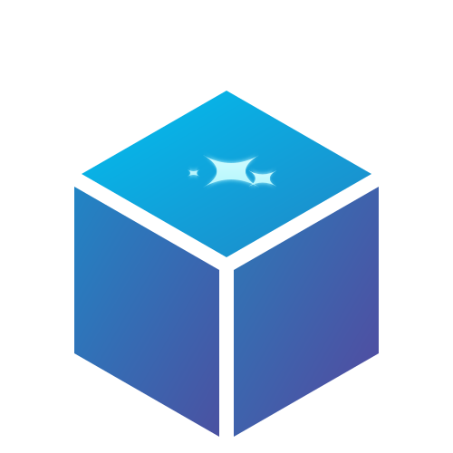

<p align="center">
  
</p>

<h1 align="center">renderdesk</h1>

<p align="center">
  A self-hosted store for LLM-generated artifacts, reachable over MCP.
</p>

<p align="center">
  <a href="https://github.com/garage1118/renderdesk/actions/workflows/docs.yml"></a>
  <a href="https://hub.docker.com/r/garage1118/renderdesk"></a>
  <a href="LICENSE"></a>
</p>

---

renderdesk is a self-hosted store for LLM-generated artifacts
(self-contained HTML/Markdown/code/CSV/React documents), reachable over
MCP so agents — Claude Code, Claude on the web, ChatGPT, or any MCP
client — can publish and update them the way Claude's own `Artifact`
tool does, except self-hosted. A web dashboard lets a human browse,
comment on, and share what gets published.

## Quick start

```bash
docker run -d --name renderdesk \
  -p 8000:8000 \
  -v renderdesk-data:/app/data \
  -e RENDERDESK_PUBLIC_BASE_URL=http://localhost:8000 \
  -e RENDERDESK_AUTH_SCHEME=password \
  garage1118/renderdesk:latest

# create the first dashboard account
docker exec -it renderdesk renderdesk create-user --email you@example.com
```

Put renderdesk behind a reverse proxy with TLS for anything beyond
local use, and set `RENDERDESK_PUBLIC_BASE_URL` to the public HTTPS
URL you're serving it at.

## Documentation

Full documentation — getting started, the dashboard guide, the MCP
tool reference, and the CLI reference for administrators — is at
**[garage1118.github.io/renderdesk](https://garage1118.github.io/renderdesk/)**.

## Changelog

See [CHANGELOG.md](CHANGELOG.md).

## License

[MIT](LICENSE)
